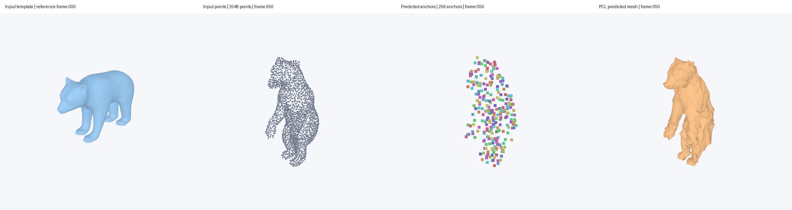
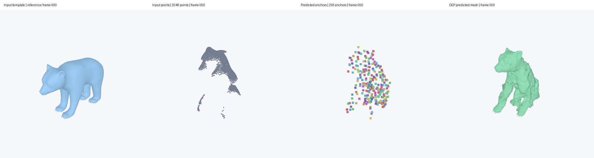

<div align="center">

# ERNet
### Template mesh tracking from point-cloud sequences

[Model weights](#1-download-the-model-weights) · [Setup](#2-set-up-the-environment) · [Run inference](#3-run-inference) · [Release checklist](#release-checklist)

</div>

ERNet tracks a template mesh through a sequence of point clouds. This repository
provides inference code, two bear examples, and visualization of the input
template, input points, predicted anchors, and predicted mesh.

**PCL demo: template → input points → predicted anchors → predicted mesh**



<details>
<summary>DEP demo using camera-visible depth points</summary>



</details>

## Release checklist

- [x] Release inference code for the PCL and DEP models.
- [x] Release pretrained PCL and DEP checkpoints.
- [x] Provide template-and-points examples and four-panel visualization.
- [ ] Release the full evaluation code and benchmark instructions.
- [ ] Release the training code and training configurations.

This initial release focuses on inference. Full evaluation and training code
will follow in this repository.

## 1. Download the model weights

Download the checkpoints manually from the separate Google Drive links below.
The weights are not included in this repository or downloaded by the setup script.

| Model | When to use it | Checkpoint filename | Download |
| --- | --- | --- | --- |
| **PCL** | Point clouds sampled across the object's surface. The included PCL example uses uniform surface samples. | `train_w_skinning_647500.pth` | [Google Drive](https://drive.google.com/file/d/1a0ZGCJfdBJHqE8frg6Wo0eA6e_Y-sBak/view) |
| **DEP** | Partial point clouds obtained by back-projecting depth images, containing the surface visible to a camera. | `train_w_skinning_dep_542200.pth` | [Google Drive](https://drive.google.com/file/d/1PpV8EZAWaiFPJIHnViHpguegwz0ePzLp/view) |

Both checkpoints use the same architecture and predict anchor motion and
skinning radii to deform the template. They are trained for different input
sampling settings; choose the checkpoint that matches your point clouds.
The PCL example is a sparse observation of the full surface, while the DEP
example is a camera-visible partial observation.

Create a `model/` directory at the repository root and place the downloaded
files there with these exact names:

```text
model/
├── train_w_skinning_647500.pth
└── train_w_skinning_dep_542200.pth
```

Each checkpoint includes its deformer weights; no additional checkpoint is
required. You only need the checkpoint for the mode you plan to run.
If you store weights elsewhere, pass `--weights-dir /path/to/weights`.

## 2. Set up the environment

Requirements: Linux, Conda, Git, a C++ compiler, an NVIDIA GPU with a compatible
driver, and a CUDA 12.x toolkit containing `nvcc`. Headless rendering requires
EGL support. The tested setup uses an RTX 6000 Ada, CUDA toolkit 12.8, Python
3.10, and PyTorch 2.4.1 with CUDA 12.4 wheels.

Clone the repository, then install the environment:

```bash
git clone https://github.com/guangzhaohe/ERNet.git
cd ERNet

# Set CUDA_HOME to your installed CUDA toolkit.
CUDA_HOME=/usr/local/cuda-12.8 bash setup.sh
conda activate scenetracker
```

The script installs `environment.yml` and `requirements.txt` into
`.conda/envs/scenetracker`, links that environment into Conda's environment
directory, and keeps package/build caches inside the project. The CUDA KNN
extension compiles on first import. To check an existing installation:

```bash
bash setup.sh --check
```

## 3. Run inference

### Included examples

Each example contains a template mesh and 101 frames of 2,048 input points.
The folder selects its matching model automatically.

```bash
# Surface-sampled points → PCL model
python main.py assets/bear_pcl

# Back-projected depth points → DEP model
python main.py assets/bear_dep
```

Open the resulting videos:

```text
output/bear_pcl/pcl/preview.mp4
output/bear_dep/dep/preview.mp4
```

Each video shows four synchronized panels: **input template → input points →
predicted anchors → predicted mesh**. Anchor colors stay consistent throughout
the sequence. Videos contain all 101 frames at 24 fps.

The same folders contain `predicted_vertices.npy` (`frames × vertices × 3`),
`prediction.anime`, `predicted_controls.npy`, and other inference outputs.
The included examples are already normalized, and their predictions use the
same normalized coordinates. No original animation or ground-truth sequence
is needed to run them.

### Your own template and point sequence

Prepare a directory containing `template.ply`, `points.npz`, and `demo.json`,
following the [input format and normalization instructions](assets/README.md).
Then run:

```bash
python main.py /path/to/your_case --output ./output
```

### DT4D animation files

If you have a DT4D `.anime` file, run both sampling settings and models with:

```bash
python main.py /path/to/sequence.anime --mode both --output ./output
```

This takes frame 0 as the template and generates surface or depth point inputs
from the animation. Preprocessing uses the complete source meshes for
per-frame centering and a shared scale. Predictions are restored to the
animation's original coordinates.

### Useful options

| Option | Purpose |
| --- | --- |
| `--mode pcl` / `--mode dep` | Select a single model. |
| `--weights-dir PATH` | Load checkpoints from another directory. |
| `--output PATH` | Change the output parent directory (default: `./output`). |
| `--no-preview` | Save predictions without rendering videos. |
| `--render-only` | Regenerate videos from existing predictions using the same input and output paths. |
| `--overwrite` | Replace an existing case's predictions. |

Weights, environments, caches, and generated outputs are excluded from Git.
Code provenance is documented in [THIRD_PARTY.md](THIRD_PARTY.md).

## Acknowledgements

This implementation uses components from [ConvONet](https://github.com/autonomousvision/convolutional_occupancy_networks),
[CoTracker](https://github.com/facebookresearch/co-tracker),
[U-Net](https://github.com/jaxony/unet-pytorch), and CUDA KNN.
The bear examples come from DeformingThings4D. See [THIRD_PARTY.md](THIRD_PARTY.md)
for source references and retained attributions.

## Issues

For installation or inference problems, please open a
[GitHub issue](https://github.com/guangzhaohe/ERNet/issues) with the command,
error traceback, GPU model, and CUDA/PyTorch versions.
